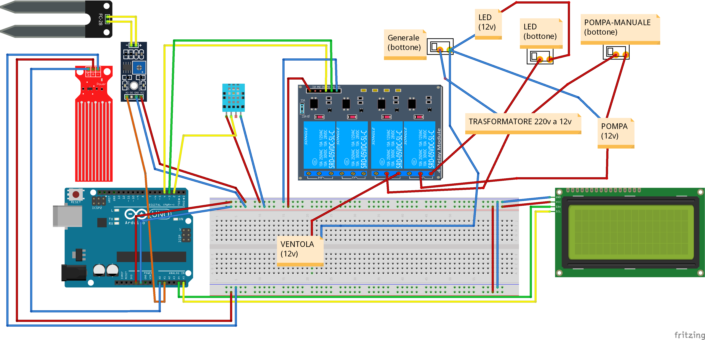

# GreenHouse Arduino
**An intelligent and automated way to grow plants in a controlled environment.**

- **File language:** *Italian* [Wiki](https://github.com/denilson-polonio/greenhouse-arduino/wiki)
- **Download:** *-*

# Schematic

